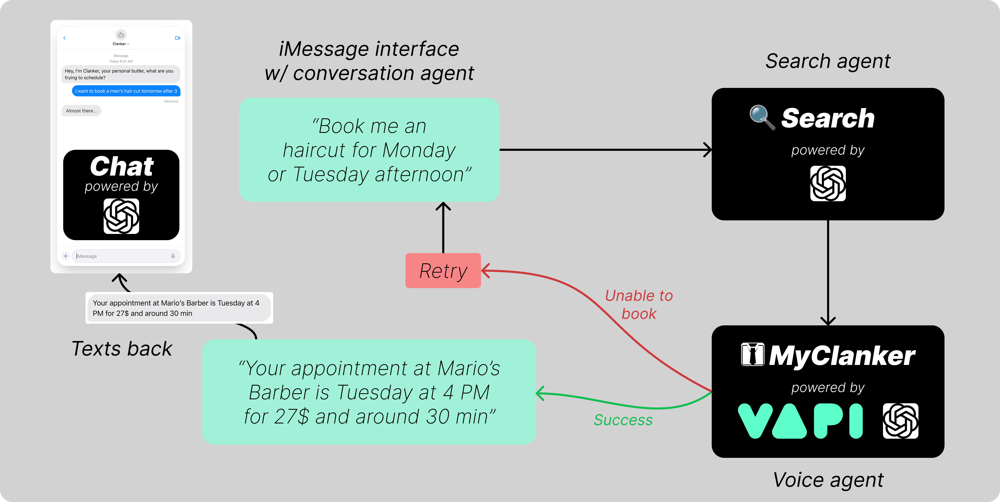

# MyClanker: Your Booking Pipeline

## Overview

MyClanker is an AI-powered assistant that automates appointment booking through a multi-agent pipeline.
The system combines conversational AI, search capabilities, and a voice-based booking agent to provide a seamless booking experience via iMessage.

MyClanker can search web shops and local businesses nearby, find what you need, and complete the booking for you.

## Frontend

[clanker-frontend](https://github.com/JonCGroberg/clanker-frontend)

## Pipeline Flow

1. User Initiates Booking (iMessage Interface). The process begins when a user sends a booking request via iMessage, such as “Book me a haircut for Monday or Tuesday afternoon”. This message is handled by the Conversation Agent, powered by a chat model.

2. Search Agent. The Conversation Agent interprets the user’s intent and sends a query to the Search Agent, which is responsible for finding matching appointment slots.

3. Voice Agent (MyClanker). The Search Agent passes the relevant details to the Voice Agent (powered by VAPI and a chat model), which contacts the service providers to confirm availability and pricing.

4. Possible Outcomes. The pipeline has two possible outcomes:
    - Success Path (Green). The booking is confirmed. The Conversation Agent texts back details like: “Your appointment at Mario’s Barber is Tuesday at 4 PM for $27 and around 30 min.”
    - Failure Path (Red). If the booking cannot be completed (e.g., no available slots), the system enters the Retry loop or ends with Unable to book.